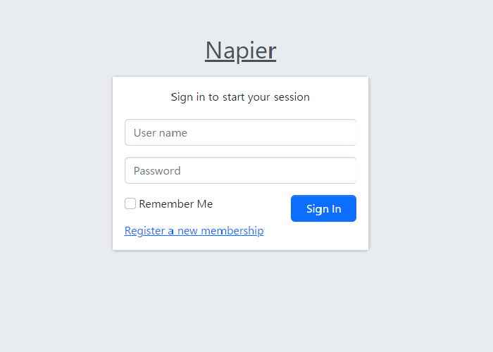

# Napier

Napier は websocketを使った逆プロキシのシステムです。

## 概要

Napierは転送用のコネクションにweb socketを使った逆プロキシシステムです。


このため、ネットワーク的にNapierが見えてさえいれば、プロキシ先を置くことができます。

## 仕組み

Napier serverは、起動するとweb用のポート(port 80, port 443)と転送用のポート(port 8000)を開きます。

web用ポートに接続されたURLのパス部が`/manage`の場合は設定用のウェブUIを送信します。

それ以外のURLの場合、そのURLに対応した転送ルールを検索します。転送ルールに合致した場合、その転送先に転送を行います。

転送のためのコネクションは、転送用ポートにプロキシのクライアントが接続することによって生成されます。この接続は(secure) web socketによって作られています。

プロキシのクライアントはローカル接続のためのポートを開き、ローカルにあるウェブサーバに接続を仲介します。

プロキシのクライアントにはウェブサーバが組み込まれており、有効にすると指定したディレトリ以下をプロキシ経由で公開することが可能になっています。

## クイックスタート

### インストール

現在のところ、リリースパッケージは存在していません。そのため、ソースを取り寄せて実行して下さい。

```shell
$ git clone https://github.com/waspcojp/napier.git
$ npm update
```

### 設定

#### サーバ

```shell
$ cd napier
$ sudo chown root .
$ sudo npm run server
```

サーバは起動時に`config/server.js`を読み込みます。

まずは、`config/server-sample.js`を`config/server.js`として読み込むように`ln -s`するか`mv`して下さい。

```javascript
module.exports = {
    HTTP_PORT: 8000,
    HTTPS_PORT: 8443,
    WS_PORT: 8001,
    LOCAL_PORT_RANGE: [9000, 9100],
    APPL_PORT: 3331,
    MY_DOMAIN: 'shibuya.local',
    home: process.env.HOME,
    session_ttl: 3600 * 24 * 7,
    session_path: `${process.env.PWD}/sessions`,
    cert_path: `${process.env.PWD}/certs`,
    content_path: `${process.env.PWD}/page`
};
```

このうち、必ず修正しなければならないのは、`MY_DOMAIN`だけです。他は特に不都合がなければそのままで構いません。

httpsを使うためには、証明書が必要です。ローカルで試すだけならオレオレ証明書(自己署名証明書)でも構いませんが、グローバルに置くためには、正しく取得する必要があります。デフォルトの設定の場合は、`./cert`直下に証明書と秘密鍵を起きます。この辺は「クイックスタート」にしては厄介なので、後程説明します。

httpsのみ接続許可する場合は、`HTTP_PORT`は不要です。同様にhttpのみで接続許可する場合は、`HTTPS_PORT`は不要です。

### アカウント作成

**注** デフォルトアカウントは存在しません。

サーバを起動して接続可能になったら、アカウントを作成します。

非login状態で`www.${MY_DOMAIN}/manage`にアクセスすると、



のように表示されますので、'Register a new membership'をクリックして下さい。


現在は特にメール認証のようなものは行っていません。そのまま登録されます。

### クライアント

クライアントを接続するには、

```shell
$ npm run cli -- <options>
```

のように実行します。起動オプションは、

```
Usage: napier-cli [options] [profileName]

Arguments:
  profileName                        profile name (default: "default")

Options:
  --config <config filename>         config file
  --user <user>                      user name
  --pass <pass>                      password
  --host <host>                      tunnel host
  --port <port>                      tunnel port
  --local-port <localPort>           local port
  --re-connect                       re-connect server
  --web-server                       start web server
  --server-config <config filename>  web server config file
  --document-root <path>             web server document root
  --index                            list index
```

このうち、必ず指定するものは、`--user`, `--pass`, `--host`です。

コマンドラインで指定するオプションは、

```javascript
{
    "host": "www.napier-net.com",
    "localPort": 4001,
    "reConnect": true,
    "webServer": false,
    "user": "****",
    "pass": "****",
    "documentRoot": "."
}
```

のようにファイルに格納して`--config`で指定することも可能です。

コマンドラインの最後は「プロファイル」の指定となっていますが、これについては後程説明します。指定しない場合はデフォルトとなりますが、この時にプロキシが起動されるURLは、

```
(http|https)://<サーバのURL>/<ユーザ名>
```

となります。

`--web-server`を指定すると、組み込みウェブサーバが起動します。`--document-root`で指定したディレクトリをdocument rootとするウェブサーバが起動され、プロキシ経由で外からアクセス可能になります。

### デモサイト

[デモサイト](https://www.napier-net.com)を作りましたので、サーバの設定なしで試してみることが可能です。

サイトにアクセスしてユーザ登録を行った後にクライアント起動すると試すことが可能です。

なお、このURLのサイトは将来的には正式なサービスとしてリリースする予定ですが、その時にはユーザ情報は引き継がれませんので、注意して下さい。

## 解説

### 証明書について

`certs`に置くファイルは以下になります。

* `${MY_DOMAIN}-cert.pem`

  いわゆる証明書です。これは中間証明書を含んだものを使います。Let's Encryptで言えば、`fullchain.pem`です。

  中間証明書を含まない証明書を使うと、「webでは問題ないがweb socketがつながらない」という事態が起きるので注意してください。

* `${MY_DOMAIN}.pem`

  秘密鍵です。

なお、実行時に証明書を含んだrouteがstartされた場合には、`数字-cert.pem`, `数字.pem`という名前のの証明書ペアがこのディレクトリに置かれます。これらはstartする度にデータベースから実体を作るので、邪魔だと思ったら消してしまっても問題ありません。